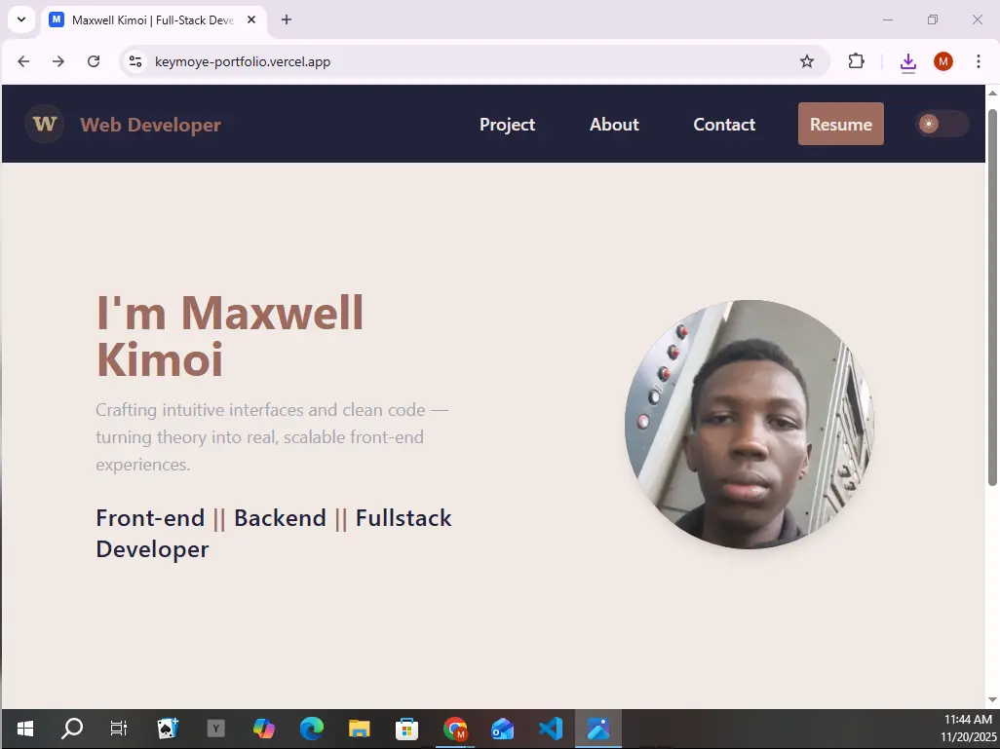
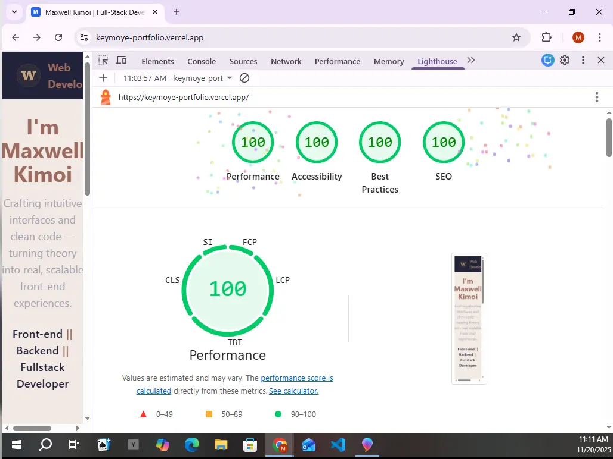
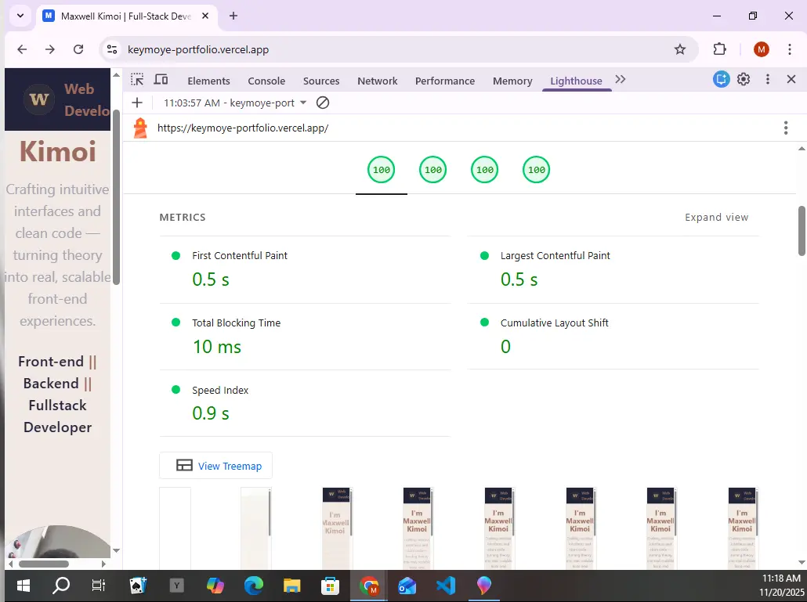

# 🌐 Maxwell Kimoi — Full-Stack Developer Portfolio

A modern, fast, and fully responsive **developer portfolio** built with **React**, **TypeScript**, **Vite**, and **Tailwind CSS**.  
Designed with premium UI/UX principles, smooth animations, a production-grade contact workflow, and perfect Lighthouse scores.

---

<div align="center">

[](https://keymoye-portfolio.vercel.app)
[](./LICENSE)


</div>

---



🧭 **Live Demo:**  
https://keymoye-portfolio.vercel.app

---

## ✨ Overview

This portfolio represents your **professional identity** as a developer — crafted with clean architecture, smooth animations, a strong focus on accessibility, perfect performance scores, and a secure contact workflow powered by **Resend API + Supabase Edge Functions**.

It demonstrates excellence in:

- UI polish  
- Component architecture  
- Accessibility  
- Full-stack integration  
- Testing and code quality  
- Production-ready performance  

---

## 🚀 Features

| Icon | Feature | Description |
| :--: | ------- | ----------- |
| 🎨 | **Modern UI** | Smooth animations, responsive layout, elegant design |
| 🌓 | **Dark / Light Theme** | Persistent theme toggle using local storage |
| 🧭 | **Accessible Navigation** | Full keyboard support + ARIA-compliant mobile menu |
| ✉️ | **Contact Form (Production-Ready)** | Email delivery via Resend API + validation + error states |
| ⚡ | **High Performance** | Perfect Lighthouse scores across all categories |
| 🧪 | **Tested Components** | Vitest + React Testing Library |
| 🧱 | **Type-Safe Codebase** | Built fully with TypeScript |
| 🗂️ | **Organized Architecture** | Clean folder structure and component reuse |

---

## 🛠 Tech Stack

### **Frontend**
- React 19
- TypeScript
- Tailwind CSS
- Framer Motion
- React Router

### **Build & Tooling**
- Vite
- ESLint + Prettier
- Vitest + React Testing Library

### **Backend Integration**
- Resend API (email)
- Supabase Edge Functions

---

## 📁 Project Structure

```
my-portfolio/
├── public/
│   └── screenshot-2.webp     # Main portfolio screenshot
├── src/
│   ├── assets/
│   │   ├── lighthouse-3.webp # Lighthouse screenshot 1
│   │   └── lighthouse-4.webp # Lighthouse screenshot 2
│   ├── components/           # Reusable UI components
│   ├── pages/                # Page-level components
│   ├── hooks/                # Custom hooks
│   ├── test/                 # Tests (Vitest + RTL)
│   ├── App.tsx
│   └── main.tsx
├── package.json
├── README.md
├── tsconfig.json
└── vite.config.ts
```

---

## 📊 Lighthouse Performance Report

| Category           | Score |
| ------------------ | :---: |
| **Performance**    |  100  |
| **Accessibility**  |  100  |
| **Best Practices** |  100  |
| **SEO**            |  100  |

### Core Web Vitals

| Metric | Value |
| ------ | ----- |
| **FCP** (First Contentful Paint) | 0.5 s |
| **LCP** (Largest Contentful Paint) | 0.5 s |
| **TBT** (Total Blocking Time) | 40 ms |
| **CLS** (Cumulative Layout Shift) | 0 |
| **Speed Index** | 1.0 s |

**Lighthouse Screenshots:**

  


---

## 🧩 Installation & Setup

1. **Clone the repository**
```bash
git clone https://github.com/Keymoye/my-portfolio.git
cd my-portfolio
```

2. **Install dependencies**
```bash
npm install
```

3. **Run locally**
```bash
npm run dev
```

4. **Build for production**
```bash
npm run build
```

5. **Preview production build**
```bash
npm run preview
```

---

## 🧪 Testing

Run the full test suite:

```bash
npm test
```

Run tests in UI mode:

```bash
npm run test:ui
```

Generate coverage:

```bash
npm run test:coverage
```

---

## 🌍 Deployment (Vercel)

This project is deployed on **Vercel**.

**Build settings:**
- Build command: `npm run build`
- Output directory: `dist`
- Install command: `npm install`

---

## 🧪 Test Environment (for Lighthouse report)

- **Device:** Emulated Desktop  
- **Browser:** Chromium 142  
- **Lighthouse:** 12.8.2  
- **Session:** Initial page load  
- **Throttling:** Custom  

---

## 🪪 License

This project is licensed under the **MIT License**.  
See [LICENSE](./LICENSE) for more details.

---

## 🧑‍💻 Author

**Maxwell Kimoi (Keymoye)**  
📍 Nairobi, Kenya  
💼 Full-Stack Developer — React • TypeScript • Tailwind • Vite  
🌐 https://keymoye-portfolio.vercel.app  
🐙 GitHub: https://github.com/Keymoye  
📧 Email: bowenmaxwell9@gmail.com

---

⭐ **If you found this project useful, please consider starring the repository!**

